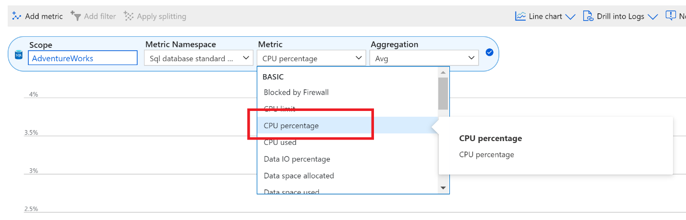

---
lab:
    title: 'Lab 4 – Monitor and Optimize Resources'
    module: 'Monitor and Optimize Operational Resources'
---

# Lab 4 – Monitor and Optimize Resources


**Estimated Time**: 60 minutes

**Pre-requisites**: Lab VM, and Azure SQL Database created in Labs 2 and 3


# Lab overview


The students will take the information gained in the lessons to scope out the deliverables for a digital transformation project within AdventureWorks. Examining the Azure portal as well as other tools, students will determine how to utilize native tools to identify and resolve performance related issues. Finally, students will be able to identify fragmentation within the database as well as learn steps to resolve the issue appropriately. 


# Lab objectives


After completing this lab, you will be able to:

1. Isolate performance problems through monitoring. 

2. Utilize query store to locate & resolve blocking issues by creating a new index

3. Detect and correct fragmentation issues. 


# Scenario


You have been hired as a database administrator to identify performance related issues and provide viable solutions to resolve any issues found. AdventureWorks has been selling bicycles and bicycle parts directly to consumers and distributors for over a decade. The company utilizes a mixture of both Azure SQL Databases as well as a SQL Server in an Azure Virtual Machine. Recently the company has noticed performance degradation within both products that are used to service customer requests. You need to use the Azure portal as well as on-premises tools to identify the performance issues and suggest methods to resolve them. 
 
        

**Note:** The exercises ask you to copy and paste T-SQL code. Please verify that the code has been copied correctly, with the proper line breaks, before executing the code. 

        

# Exercise 1: Isolate problems by monitoring


Estimated Time: 30 minutes

The main tasks for this exercise are as follows:

1. Review monitoring solutions to identify performance related issues for Azure SQL Database

2. Use Query Store to identify any ongoing blocking issues as well identify appropriate indexes to implement to resolve the blocking. 

3. Use querying tools to identify index fragmentation as well as provide a method to resolve the fragmentation. 

 

## Task 1: Review CPU Utilization in Azure Portal

1. If you're not already in the Azure portal, navigate back to portal.azure.com. You may need to login again. In the search bar at the top of the Azure Portal, type SQL, and click on SQL databases. This task will use the AdventureWorks database you created in Lab 3. Click on the database name.


    


2. Locate and select  Metrics on the Monitoring section of the blade for the AdventureWorks database. 


3.  Change the Metric menu option to reflect CPU percentage

 
    

4. Select an Aggregation of “Avg”. This will display the average CPU Percentage for the given time frame. 

5. Now adjust the aggregation to Max to identify the maximum CPU Percentage used for the give time frame. How is it different from the average?

## Task 2: Identify High CPU Consuming Queries

1. In the same view as shown in first task, select Query Performance Insight in the same menu under Intelligent Performance.

    

    

2.  Click on the first query in the grid below the graph. 


    

3. Make note of the query, and its resource usage as shown in the following image. Azure tracks CPU, Data IO, and Log IO for each query.

 
    


# Exercise 2: Identify and Resolve Blocking Issues


Estimated Time: 15 minutes

Individual exercise

The main tasks for this exercise are as follows:

1. Determine which query is causing blocking by utilizing the blocking report with extended events

2. Identify indexes that could be implemented to resolve the blocking

## Task 1: Run blocked queries report

For this exercise, you will be using SQL Server Management Studio from the lab VM and connecting to an on-premises SQL Server. 

1.  From the lab VM, open SQL Server Management Studio, by opening the start menu and navigating to   
    Microsoft SQL Server Tools 18> Microsoft SQL Server Management Studio. Alternatively, you can select the icon for the Management Studio in your task bar. 

2. Start a new query by clicking the New Query button in Management Studio.

    

    You will be prompted to connect to your SQL Server.


    

    Enter LON-SQL1 for the local server name, and ensure that Windows Authentication is selected, and click connect.


3. Copy and paste the code below into your query window. 

 
    ```sql
    USE MASTER

    GO

    CREATE EVENT SESSION [Blocking] ON SERVER 

    ADD EVENT sqlserver.blocked_process_report(

    ACTION(sqlserver.client_app_name,sqlserver.client_hostname,sqlserver.database_id,sqlserver.database_name,sqlserver.nt_username,sqlserver.session_id,sqlserver.sql_text,sqlserver.username))

    ADD TARGET package0.ring_buffer

    WITH (MAX_MEMORY=4096 KB, EVENT_RETENTION_MODE=ALLOW_SINGLE_EVENT_LOSS, MAX_DISPATCH_LATENCY=30 SECONDS, MAX_EVENT_SIZE=0 KB,MEMORY_PARTITION_MODE=NONE, TRACK_CAUSALITY=OFF,STARTUP_STATE=ON)

    GO

    -- Start the event session 

    ALTER EVENT SESSION [Blocking] ON SERVER 

    STATE = start; 

    GO
    ```

    Click the execute button to execute this query. 

    The above T-SQL code will create an Extended Event session that will capture blocking events. The data will contain the following elements:

    - Client application name

    - Client host name

    - Database ID

    - Database name

    - NT Username

    - Session ID

    - T-SQL Text

    - Username


4. Click New Query from SQL Server Management Studio. Copy and paste the following T-SQL code into the query window. Click the execute button to execute this query. 

    ```sql
    USE AdventureWorks2017

    GO

    BEGIN TRANSACTION

    UPDATE Person.Person SET LastName = LastName;

    GO
    ```
 

5. Open another query window by clicking the New Query button. Copy and paste the following T-SQL code into the query window. Click the execute button to execute this query. 

    ```sql
    USE AdventureWorks2017

    GO

    SELECT TOP (1000) [LastName]

    ,[FirstName]

    ,[Title]

    FROM Person.Person

    WHERE FirstName = 'David'
    ```
    

    You should notice that this query does not return results immediately and appears to be still running.


6. In Object Explorer, navigate to Management, and expand the hive by clicking the plus sign. Expand the Extended Events hive and then expand the Sessions Hive. Expand the Blocking session that was created in step 3. Right click on package0.ring_buffer and select View target data. 

    

7. Click on the hyperlink. 

    

8. The XML will show you which processes are being blocked and which process is causing the blocking. 

    
 
9.  Right click the Extended Events session (the one called Blocking) and select Stop Session. 

10.  Navigate back to the query tab you opened in step 4, and type ROLLBACK TRANSACTION on the line below the query. Highlight ROLLBACK TRANSACTION and execute the command.

  
 
11. Navigate back to the query tab you opened in Step 5. You will notice that the query has now completed.

12. Close all your query windows.

## Task 2: Enabling Read Committed Snapshot Isolation

1. Open a new query window. Copy and paste the following T-SQL code into the query window. Click the execute button to execute this query. 

```sql
USE master

GO

ALTER DATABASE AdventureWorks2017 SET READ_COMMITTED_SNAPSHOT ON WITH ROLLBACK IMMEDIATE;

GO
```
2. Copy and paste the following T-SQL code into a new query window. Click the execute button to execute this query. 
```sql
USE AdventureWorks2017

GO

BEGIN TRANSACTION

UPDATE Person.Person SET LastName = LastName;

GO
```
 

3. Copy and paste the following T-SQL code into a new query window. Click the execute button to execute this query. 

```sql
USE AdventureWorks2017

GO

SELECT TOP (1000) [LastName]

 ,[FirstName]

 ,[Title]

 FROM Person.Person

 WHERE firstname = 'David';
 
 GO
```

4. Discuss with the instructor why the query in step 3 now completes whereas in the previous exercise it was blocked by the UPDATE. Keep SQL Server Management Studio open as you will need it in the next exercise, but close all your query windows. 


# Exercise 3: Detect/Correct Fragmentation Issues


Estimated Time: 15 minutes

Individual exercise

The main tasks for this exercise are as follows:

1. Identify fragmentation 

2. Remove fragmentation

2. The instructor will discuss the findings with the group.

## Task 1: Identify fragmentation

1. In SQL Server Management Studio, click the New Query button. Copy and paste the following T-SQL code into the query window. Click the execute button to execute this query. 

```sql
USE AdventureWorks2017
GO

INSERT INTO [Person].[Address]

 ([AddressLine1]

 ,[AddressLine2]

 ,[City]

 ,[StateProvinceID]

 ,[PostalCode]

 ,[SpatialLocation]

 ,[rowguid]

 ,[ModifiedDate])

SELECT AddressLine1,

 AddressLine2, 

 'Amsterdam',

 StateProvinceID, 

 PostalCode, 

 SpatialLocation, 

 newid(), 

 getdate()

FROM Person.Address;


GO
```
This query will increase the fragmentation level of the Person.Address table and its indexes.


2. Copy and paste the following T-SQL code into a new query window. Click the execute button to execute this query. 

```sql
USE AdventureWorks2017

GO

SELECT i.name Index_Name

 , avg_fragmentation_in_percent

 , db_name(database_id)

 , i.object_id

 , i.index_id

 , index_type_desc

FROM sys.dm_db_index_physical_stats(db_id('AdventureWorks2017'),object_id('person.address'),NULL,NULL,'DETAILED') ps

 INNER JOIN sys.indexes i ON ps.object_id = i.object_id 

 AND ps.index_id = i.index_id

WHERE avg_fragmentation_in_percent > 50 -- find indexes where fragmentation is greater than 50%
```
 
This query will report any indexes that have a fragmentation over 50%. You should see four indexes with fragmentation.


3. Copy and paste the following T-SQL code into a new query window. Click the execute button to to execute this query. 

```sql
SET STATISTICS IO,TIME ON

GO

USE AdventureWorks2017

GO

SELECT DISTINCT (StateProvinceID)

 ,count(StateProvinceID) AS CustomerCount

FROM person.Address

GROUP BY StateProvinceID

ORDER BY count(StateProvinceID) DESC;

GO
```
 

Click on the Messages tab in the result pane of SQL Server Management Studio. Make note of the count of logical reads performed by the query. 
    
   

## Task 2: Rebuild indexes

1. Click the new query button. 


2. Copy and paste the following T-SQL code into the query window. Click the execute button to execute this query. 

```sql
USE AdventureWorks2017

GO

ALTER INDEX [IX_Address_StateProvinceID] ON [Person].[Address] REBUILD PARTITION = ALL WITH (PAD_INDEX = OFF, STATISTICS_NORECOMPUTE = OFF, SORT_IN_TEMPDB = OFF, IGNORE_DUP_KEY = OFF, ONLINE = OFF, ALLOW_ROW_LOCKS = ON, ALLOW_PAGE_LOCKS = ON)
```
 

3. Re-execute the query from step 2 in Task 1. Confirm that the AK_Address_StateProvinceID index no longer has fragmentation greater than 50%. 

4. Re-execute the query from step 3 in Task 1. Make note of the logical reads in the Messages tab of the Results pane in Management Studio. Was there a change from the number of logical reads encountered before you rebuilt the index? 
